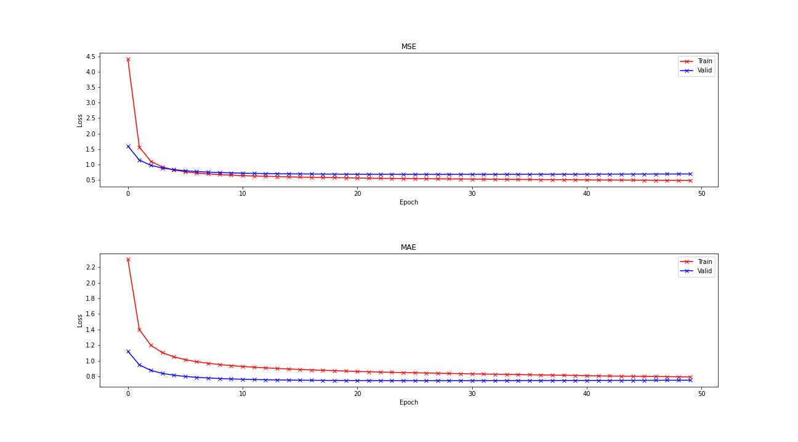

# Recommender Systems

## Data source

[The Movies Dataset](https://www.kaggle.com/rounakbanik/the-movies-dataset)
- An ensemble of data collected from `TMDB` and `GroupLens`
- Metadata on over 45,000 movies(released on or before July 2017)
- 26 million ratings from over 270,000 users
- Ratings on a scale of 1-5


## Implementation of FunkSVD

Using notebook `funksvd.ipynb`, FunkSVD updates weights using gradient descent. Furthermore, it tolerates missing values and takes only existent values into account.

The `ratings_small.csv` contains `userId`, `movieId`, and `rating` columns. In the preprocessing pipeline, the data is spiltted into training and validation sets(6:4). The ratings are normalized to zero mean and unit variance.

Hyperparameters are defined as

```python
# Set for training
featureNum = 10
lr = 8e-3
decayRate = 0.9
epochs = 50
bestMse = 1e6

# Set for regularization
regRate = 1e-2

# Set for display
showInterval = 10
```

The learning rate is decayed 0.8 every 20 epochs. The loss function is defined as MSE with regularization. The Item and user biases are also introduced to interpret the rating deviations.

The estimators for FunkSVD are Mean Squared Error(MSE) and Mean Absolute Error(MAE). MSE measures the average of the squares of the errors. MAE measures the average of the absolute values of the errors. The model is saved at best MSE while `epoch=28`, `mse=0.676`, and `mae=0.744`. The training/validation MSE and MAE over epochs are displayed as below.



The best user and item matrices are saved to the folder `funksvd`. 

## FunkSVD, SVD++, and NMF using Scikit-Learn Surprise

Using notebook `surprise.ipynb`, FunkSVD, SVD++, and NMF are performed on built-in `ml-100k` dataset. Hyperparameters are defined as

```python
# Set for training
featureNum = 10
lr = 2e-3
epochs = 50

# Set for regularization
regRate = 1e-2
```

The models are saved to the folder `surprise` and MSE and MAE estimators show as below. 

|     | FunkSVD | SVD++  | NMF    |
|-----|---------|--------|--------|
| MSE | 0.8645  | 0.8267 | 0.9592 |
| MAE | 0.7316  | 0.7121 | 0.7623 |

## Content-Based Filtering

In `contentBasedFiltering.ipynb`, description-based recommender and metadata-based recommender are implemented. The description-based recommender first computes similarities between movies using `taglines and overview`. Then, find the most similar movies to a particular movie and make recommendations. On the other hand, The metadata-based recommender compute similarities between movies using `metadata`.

In `hybridContentBasedFiltering.ipynb`, the content-based recommender is combined with the `SVD++` rating predictor to give high rating recommendations based on the particular user.